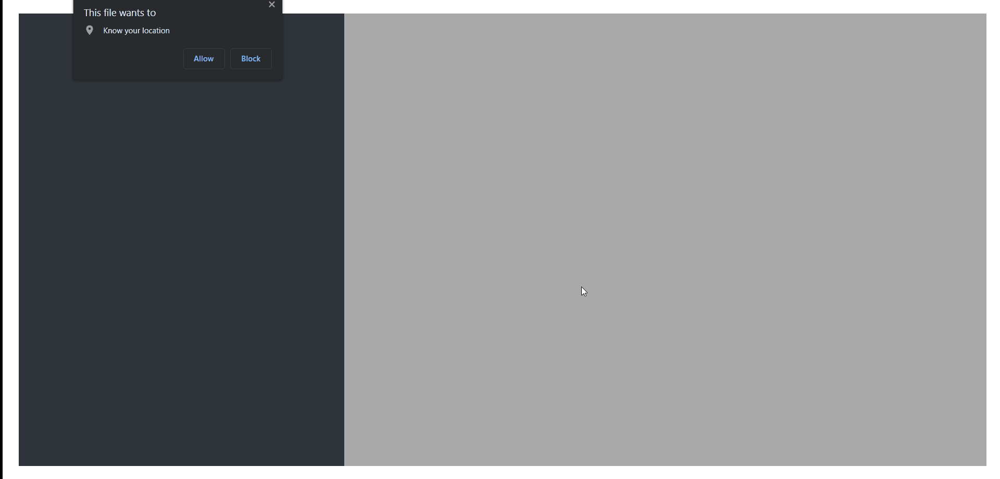
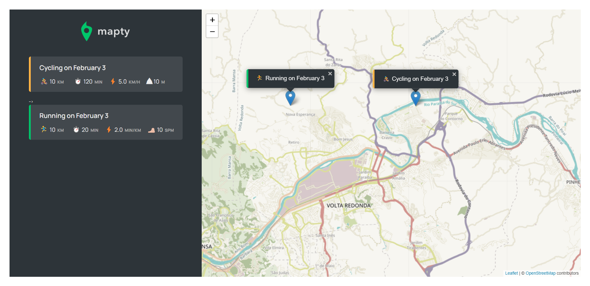

<h1 style="text-align: "center"; style="font-weight: bold;">Mapty App</h1>

<h1>Introdução</h1>

App para mapear corridas.

                 

 <a href="#sobre">Sobre</a> •
 <a href="#demonstração">Demonstração</a> •

## Sobre

O projeto é app para mapear treinos com diversas com a possibilidade de fazer marcações no mapa, escolher entre caminhada e corrida de bicicleta. 

## Demonstração
 

  <h2>Página feita com:</h2>

 Javascript

CSS

## Feito por Thiago  